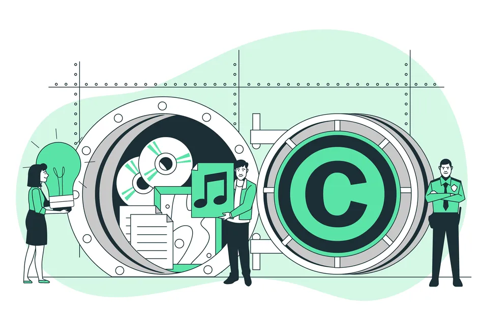

## 📊 자기 소개 (Introduction)
------

### 신입 LLM & RAG 개발자 이지우입니다.

> LLM과 RAG를 이용해 문제를 해결하는 AI 솔루션을 제작한 경험이 있습니다.

> 다양한 데이터, 특히 금융 도메인 특화 문제 해결 아키텍처를 구축하고, 이를 비즈니스에 활용하기 위한 다양한 방법을 시도하고 있습니다.

## 📊 직무 경험 (Experience)
------

**NW기준정보팀 팀원** @ LG유플러스 (2023/06 - 2024/05)

- SQL, 엑셀을 이용한 사내 네트워크 DB 구축 및 관리 업무 수행

**재무팀 팀원** @ 글뫼 (2020/11 - 2021/10)

- 영화 제작사 예정산 업무 및 재무관리 수행

## 📊 교육 (Education)
------
🏫 컴퓨터공학과 학사 취득 (2020.10 ~ 2024.04)

## 📊 보유 스킬 (Skill)
------

- Python - Pandas, Numpy, LangChain, LangGraph, Torch, Tensorflow
- SQL
- Tableau
- Google Cloud Platform (Vertex AI)
- 

## 📊 프로젝트 (Project)
------
{: width="300" height="300"}

[채권 리포트 기반 RAG 아키텍처 구축](https://github.com/DS3th-AIFFEELTHON/Bogosa)
- 금융 리포트 기반 Advanced-RAG 아키텍처 구축 및 챗봇 구현 프로젝트입니다.

{: width="300" height="300"}

[저작권법 기반 챗봇 시스템](https://github.com/highlevelnotes/Langchainthon_2)
- 저작권법 및 판례 기반 챗봇 시스템으로, 사용자가 저작권법에 근거한 다양한 질문을 던지고 답변을 받을 수 있습니다.
